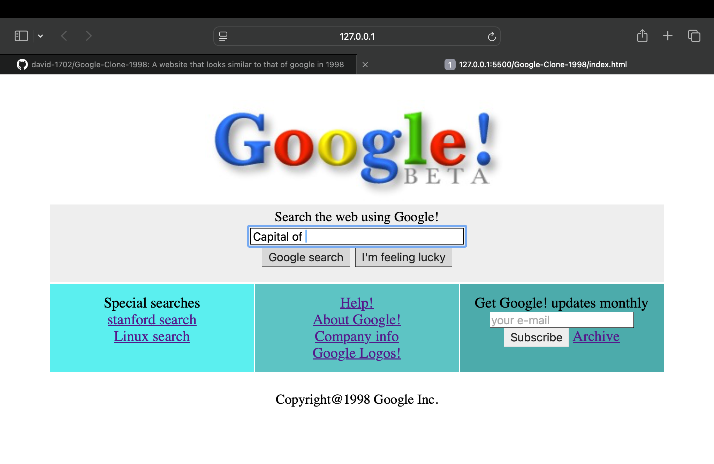
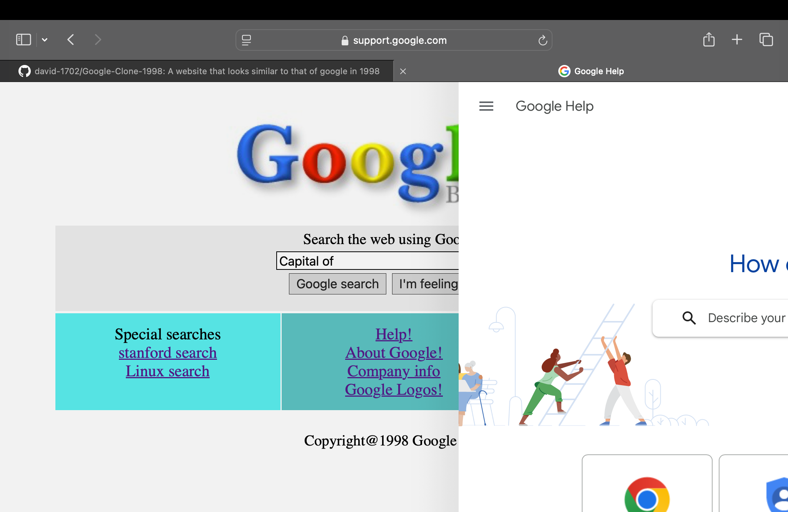

# Google-Clone-1998
 A website that looks similar to that of google in 1998
## Brief Task Description
This is a frond-end Google's search page created as a beginner web development project.The page includes a search input box(though it can't access google directly) and special searches which can be viewed.
## Screenshots


## instructions to run the project
1. **Clone the repository**:
   Open your terminal or command prompt, and run this command to download the project files:

   ```bash
   git clone https://github.com/david-1702/Google-Clone-1998.git

2. Open index.html in a browser: Navigate to the folder where you cloned the repository, find index.html, and double-click it to open in your browser. This will display the Google clone page.

HOSTED URL - https://musical-smakager-3ddcc0.netlify.app/
